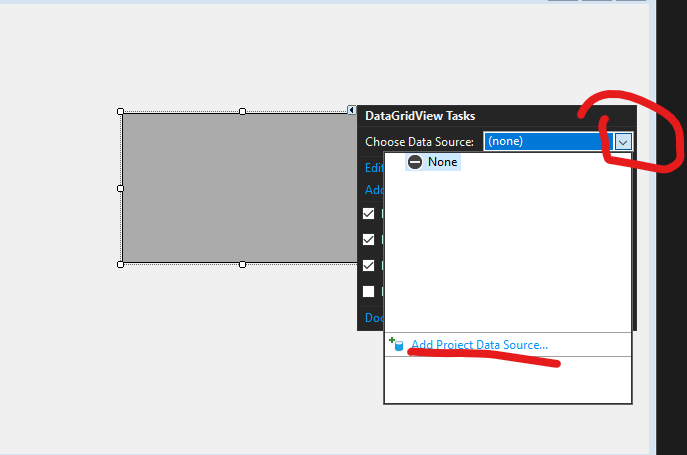
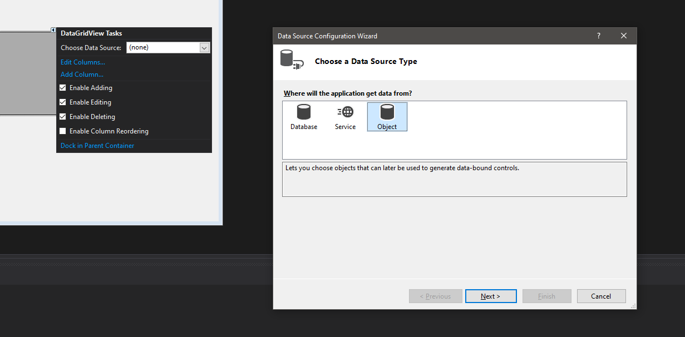
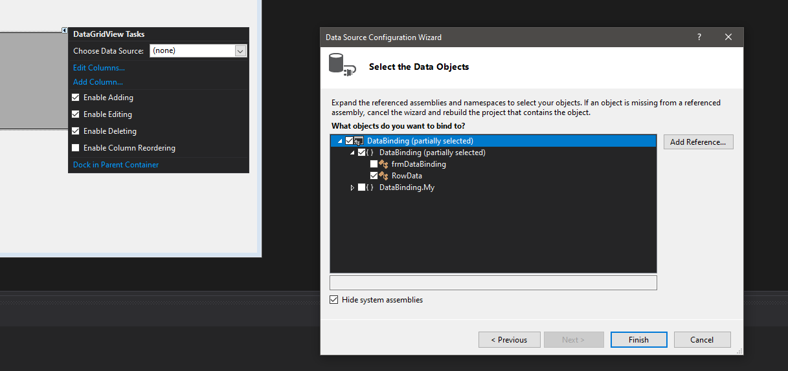
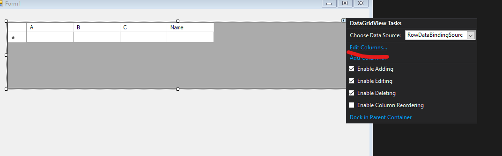
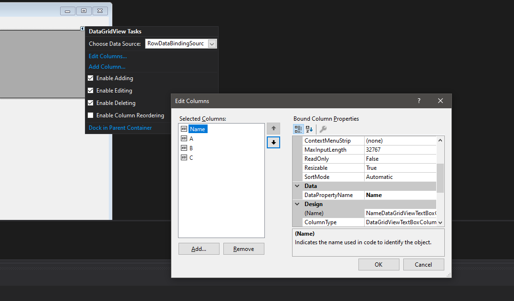
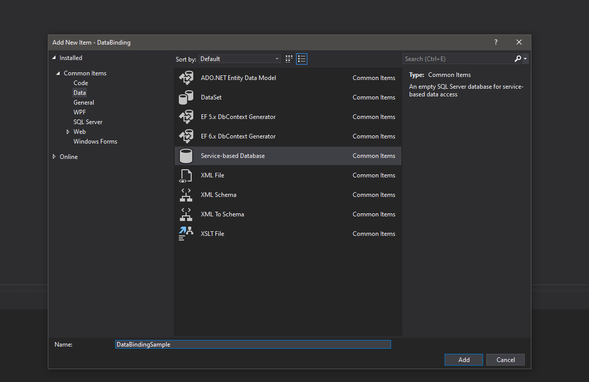
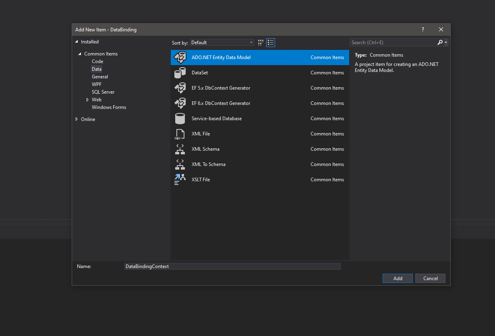

# DataBinding Tutorial

## Info

This is a walkthrough on using databinding in winforms and EF.  It will guide you through setting up databinding and entity frameowork to allow data to be read and modified with very little code.

## Steps

### **Setup Binding to Data**

1. Create a new VB Winforms Project -- 68779b3a8d51402371d36b0b979f69aa373c135d
1. Add class or classes that model your data -- 77b92b9d5343bced53fd9d2fb7a22296c09b2c1e
    - Hit <kbd>Ctrl</kbd> + <kbd>Shift</kbd> + <kbd>B</kbd> to build project.
1. Add a bound DataGridView to form -- ac7b15965d4d32672439c793b33b90646b568c00
    1. Add a DatagridView to the form
    1. Databind
        1. Set Datasource
        
        1. Pick object datasource
        
        1. Select model class or classes
        
    1. Edit Columns to move columns and set any needed properties
        1. Edit Columns 
        1. Move Name column first 

1. Add code to bind the [BindingSource](https://docs.microsoft.com/en-us/dotnet/framework/winforms/controls/bindingsource-component-overview) to the data

1. Add a temporary button that will let you see the data has been updated.
    1. Add a button
    1. In click event add this code:

    ``` vb
    MessageBox.Show($"You have {data.Count} items in the list.  The total of all C values is {data.Sum(function(r) r.C)}.")
    ```

1. Debug the project
    1. Add some rows in grid
    1. Click button.

### **Switch To DB**

1. Add DB items to project

    1. Add Service Based Database.  -- c035ce0b32bafeba0bb3cfeae4af943712564e6c
    *This adds an empty sql server database that you can modify if needed*
    

    1. Add EF Database Context
    
