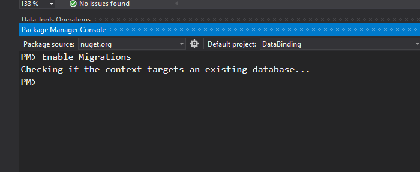
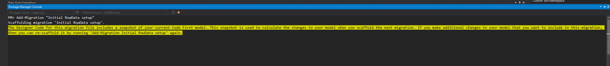
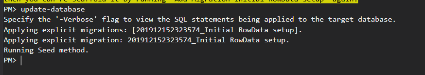
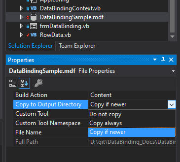

# DataBinding Tutorial

## Info

This is a walkthrough on using databinding in winforms and EF.  It will guide you through setting up databinding and entity frameowork to allow data to be read and modified with very little code.

## Steps

### **Setup Binding to Data**

1. Create a new VB Winforms Project -- 68779b3a8d51402371d36b0b979f69aa373c135d
1. Add class or classes that model your data -- 77b92b9d5343bced53fd9d2fb7a22296c09b2c1e
    - Hit <kbd>Ctrl</kbd> + <kbd>Shift</kbd> + <kbd>B</kbd> to build project.
1. Add a bound DataGridView to form -- ac7b15965d4d32672439c793b33b90646b568c00
    1. Add a DatagridView to the form
    1. Databind
        1. Set Datasource
        
        1. Pick object datasource
        
        1. Select model class or classes
        
    1. Edit Columns to move columns and set any needed properties
        1. Edit Columns 
        1. Move Name column first 

1. Add code to bind the [BindingSource](https://docs.microsoft.com/en-us/dotnet/framework/winforms/controls/bindingsource-component-overview) to the data

1. Add a temporary button that will let you see the data has been updated.
    1. Add a button
    1. In click event add this code:

    ``` vb
    MessageBox.Show($"You have {data.Count} items in the list.  The total of all C values is {data.Sum(function(r) r.C)}.")
    ```

1. Debug the project
    1. Add some rows in grid
    1. Click button.

### **Switch To DB**

1. Add DB items to project

    1. Add Service Based Database.  -- c035ce0b32bafeba0bb3cfeae4af943712564e6c
    *This adds an empty sql server database that you can modify if needed*
    

    1. Add EF Database Context -- 4c7be23160b0a64244fccaa67c0c40d62f5fd606
    

    1. Adjust connection string of context to use [DataDirectory](https://social.msdn.microsoft.com/Forums/sqlserver/en-US/dc31ea59-5718-49b6-9f1f-7039da425296/where-is-datadirectory-?forum=sqlce) -- 46d5ef4b747f59e7a6d44466c6c8e662f9d555b4

1. [Enable Migrations](https://www.entityframeworktutorial.net/code-first/code-based-migration-in-code-first.aspx) *This makes it so you are deliberate with your migrations.* -- 2fc00db8e0663a6a9110c2996e0cfa0e245520a8


1. [Run Add-Migration and Update-Database](https://www.entityframeworktutorial.net/code-first/code-based-migration-in-code-first.aspx) -- 717f17eb919a874b04a0bf188d4b3e1e896b0bae



1. Set database **Copy to Output Directory** property to **Copy if newer**  *This prevents builds from copying the database every time.  This is needed if you want to add another migration.* -- 54581d486f79eb8cc5d03d7179b47fc3c3675c20


1. Add a migration to change the length of the Name column *Add-Migration and Update-Database* -- 2211fe3645e10e687a852689ef8c2fb9fa8d284e

    ``` ps
    Add-Migration "Increase length of name"
    Update-Database
    ```

1. Seed db with initial data

    ``` ps
    Update-Database
    ```
